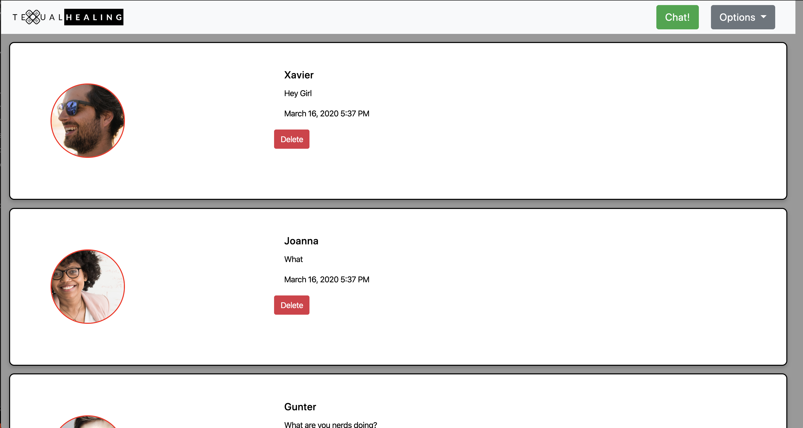
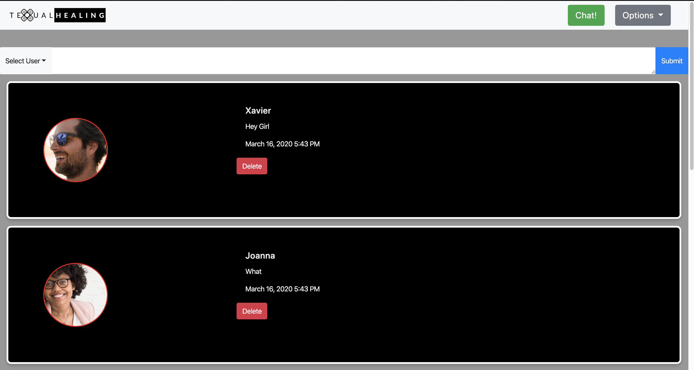

# chatty-butterworts
chatty-butterworts created by GitHub Classroom

# README.md

## Description
Basic messaging app used to communicate with friends and family. Features Dark Mode, Large Text,Change user function and the ability to delete all messages

## Technology Used
html, sass, javascript, webpack npm moments.js
## Screenshots

## How to deploy
* Clone down this project
* Install http-server
from npm
* At the root of this project run the following command npm start;

* In your browser navigate to http://localhost:8888

## Contributors

Aaron Lain, Steven Castanada, Kenny Mc, 